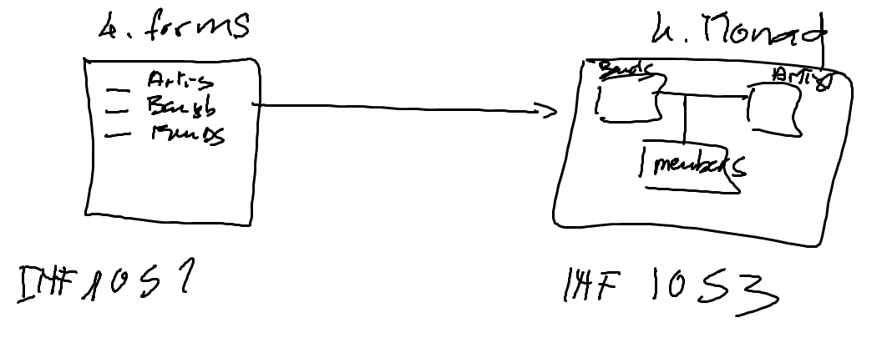

# Forms

## Pages

Écrire plusieurs pages utilisant les `reactive forms`d'angular

## Matcher le UI avec le backend

https://github.com/CollegeBoreal/INF1053-202-19H-02/tree/master/4.Monad

## References:

https://angular.io/guide/reactive-forms

